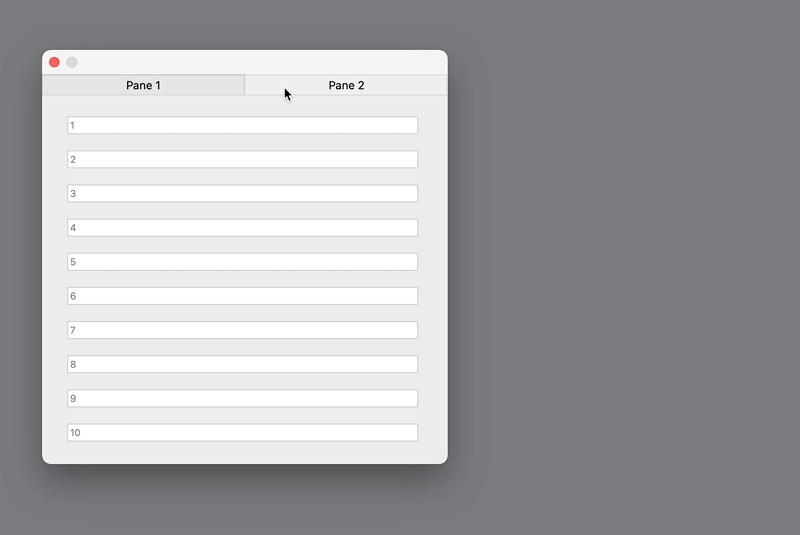

# responsive-fat-client-example
A sample library to demonstrate a responsive interface using the Omnis Studio fat client.

## Installation
1. Download `lib/responsive_fat_client_example.lbs`
1. Open with Omnis Studio 10.2 or later

## Usage
1. Click between the panes
1. Resize the window wide enough move to 2-up layout
1. Resize to a smaller width to switch back to 1-up layout

## Notes
This library uses a technique of displaying panes using subwindows. These could be replaced with fields in container objects (e.g. a Paged Panes) directly on the window at the cost of less reusable code.

A fanstastic upgrade would be to purchase Kelly Burgess' excellent [Dragster xcomp](http://www.kellyb.com/demos.html#DRAGSTER). This would allow firing the `$_layout()` method while the user resizes the window for a smoother experience.

## Contributing
Pull requests are welcome!
